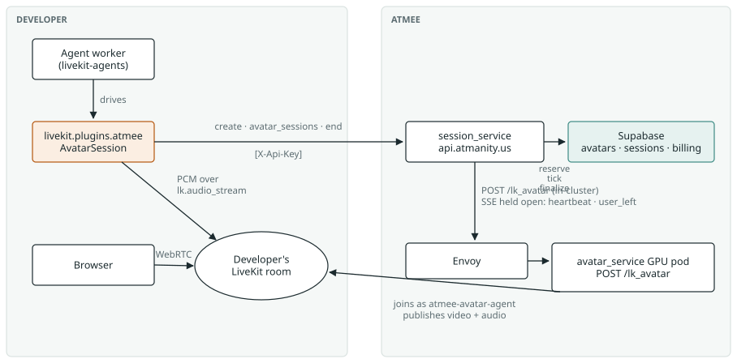
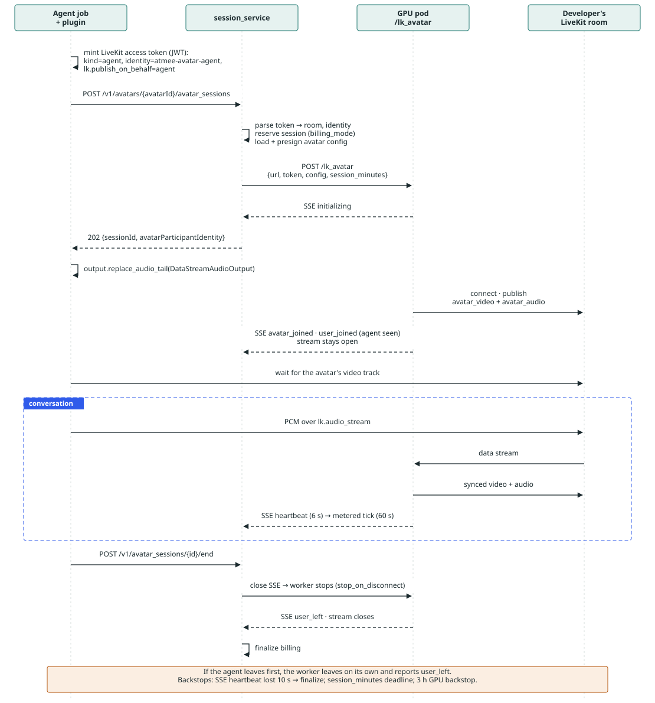
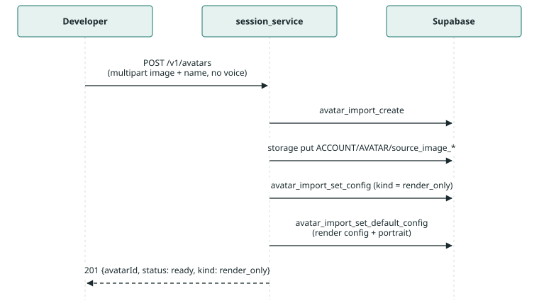

# Atmee LiveKit Avatar Plugin

arc42 architecture documentation

A developer brings their own LiveKit voice agent; Atmee renders a talking-head avatar into their room from a single portrait and bills per minute. This page documents the architecture in the twelve arc42 sections, kept deliberately short.

Status: M1 shipped, M2 / M3 planned · Date: 2026-09-10 · Repos: session_service · avatar_service · supabase-edge-functions · livekit-plugins-atmee

The same document is published as a Claude artifact (HTML, both themes) and as `docs/architecture.html` in this repo.


## 1. Introduction and goals

Developers already run voice agents on LiveKit with their own speech-to-text, language model and text-to-speech. The plugin adds a face: the agent's spoken audio is rendered as synchronized talking-head video by Atmee's GPU workers and published into the developer's room, like other LiveKit avatar plugins. Creating the avatar takes one portrait image.

```python
# once: a portrait becomes an avatar, ready immediately
avatar_id = await atmee.AtmeeAPI().create_avatar(name="Val", image="portrait.jpg")

# in the agent: three lines give it a face
avatar = atmee.AvatarSession(avatar_id=avatar_id)    # ATMEE_API_KEY in env
await avatar.start(session, room=ctx.room)
await session.start(agent=..., room=ctx.room)        # agent TTS → avatar video
```


### Quality goals

| Goal | What it means here |
|---|---|
| Simple to adopt | Three lines in an agent plus one create call. No zip bundles, no voice sample, no persona for the render-only case. |
| Least privilege | Atmee never holds the developer's LiveKit credentials. It receives a token for one room, one identity, one session. |
| Correct metering | Every rendered minute is billed to the right account, in reserve or metered mode; the meter stops when the plugin ends the session. |
| No change to the renderer | The GPU service already speaks the LiveKit avatar protocol and is used exactly as it is. |


## 2. Constraints

| Constraint | Consequence |
|---|---|
| Each developer uses their own LiveKit project | Atmee cannot observe the room from outside. Session end is reported by the plugin; the worker itself stops on LiveKit's own rules (agent left, room closed, participant removed). |
| livekit-agents 1.x avatar protocol | Audio travels over the `lk.audio_stream` data stream; the avatar publishes with the `lk.publish_on_behalf` attribute so LiveKit's UI components attribute its video to the agent. |
| Shared GPU pool | The same pods serve Atmee's own product. Capacity is admission-controlled; a full pool answers 503. |
| avatar_service is not changed | No new endpoints, no auth changes, no stream changes. `/lk_avatar` is called exactly as it exists today. |
| Python only for the first release | Package `livekit-plugins-atmee`, import `livekit.plugins.atmee`, Node later. |
| Public API convention | All external calls go through session_service with `X-Api-Key` and the existing `ApiErrorResponse` error shape. |


## 3. Context and scope



*The plugin talks to two systems: Atmee's API for the session, and the developer's own LiveKit room for audio. The GPU worker joins that room using a token the plugin minted.*


### External interfaces

| Interface | Direction | Purpose |
|---|---|---|
| `POST /v1/avatars` | developer → Atmee | Create an avatar from an image (multipart `file` + `name`, zip, or JSON with URLs). Voice optional. |
| `POST /v1/avatars/{avatarId}/avatar_sessions` | plugin → Atmee | Start rendering this avatar into a room: `livekitUrl`, `livekitToken` (a LiveKit access token for that room). Returns 202 with the session id. |
| `POST /v1/avatar_sessions/{id}/end` | plugin → Atmee | Stop the render and finalize billing. |
| `POST /lk_avatar` (SSE) | session_service → GPU worker | Starts the render; the stream carries the start handshake (`initializing`, `avatar_joined`, `user_joined`) and then closes. In-cluster only, unchanged. |
| LiveKit data stream `lk.audio_stream` | plugin → GPU worker | 16 kHz PCM segments; `lk.clear_buffer` and `lk.playback_finished` RPCs for interruption. |
| LiveKit tracks `avatar_video`, `avatar_audio` | GPU worker → room | 512×512 at 25 fps, VP9 SVC, published on behalf of the agent. |


## 4. Solution strategy

- **Reuse the renderer as it is.** The GPU service's `/lk_avatar` already joins any LiveKit URL with a given token and renders from data-stream audio. The plugin is a thin client of it, through session_service.
- **Work like other avatar plugins for the developer.** Same `AvatarSession.start()` shape, same LiveKit token minting inside the agent process, same publish-on-behalf identity mapping.
- **One public entry point.** session_service authenticates the API key, checks avatar ownership, reserves and bills the session, and is the only thing that talks to the GPU pool.
- **Lifecycle like other avatar plugins.** On shutdown the plugin removes the avatar participant (LiveKit's base `AvatarSession` already does this) and calls `/end`. If the agent dies, its participant drops and the worker leaves on its own; if the avatar drops, the plugin notices and calls `/end`. No orchestrator-to-worker channel.
- **One-shot avatar creation.** An image alone creates a render-only avatar that is ready immediately. Adding a voice later makes it conversational.


## 5. Building block view

| Block | Responsibility | Status |
|---|---|---|
| `livekit.plugins.atmee` AvatarSession · AtmeeAPI | Mints the LiveKit room token, starts the avatar session, swaps the agent's audio output for `DataStreamAudioOutput`, watches the avatar participant, and on shutdown removes it and calls `/end`. `AtmeeAPI` also creates avatars. | `new` |
| session_service · `internal/app/avatars` | Avatar Import API: create (image, zip, JSON), replace parts, status. Writes the render config for voiceless avatars. | `shipped #142` |
| session_service · `internal/app/video/render` | Avatar sessions: token pre-flight, reservation, launch via `/lk_avatar`, metered ticks, finalize on `/end` or at the ceiling. | `new` |
| session_service · adapters | Supabase RPCs, avatar launcher (SSE client), LiveKit token parsing. | `exists` + `token_claims` |
| avatar_service · `/lk_avatar` | Stateless GPU worker: joins the room, renders FLOAT talking and listening frames from the audio stream, publishes tracks, leaves when the agent leaves or the room closes. | `exists` |
| Supabase | `avatars` (config, kind), `sessions`, billing ledger and RPCs (`create_embed_session`, metered ticks, finalize). | `shipped #583` |


## 6. Runtime view



*One avatar session. The 202 returns as soon as the worker acknowledges; the plugin waits for the video track itself. The plugin ends the session; LiveKit's participant rules cover everything else.*



*Avatar creation from a portrait. Nothing is built asynchronously: the render config is written at once, so the avatar is usable immediately.*

> Ungraceful shutdown: if the agent process dies without running its shutdown callbacks, its participant drops and the worker leaves the room on its own, but no `/end` arrives, so the session bills to its ceiling. That is the accepted cost of having no orchestrator-to-worker channel; the 3 hour GPU backstop is the last resort.


## 7. Deployment view


*Release flow: supabase-edge-functions `dev` deploys to staging and `main` to production via release PRs; session_service `main` deploys to all three production clusters through Argo CD. The plugin ships from PyPI.*


## 8. Cross-cutting concepts

| Concept | Approach |
|---|---|
| Authentication | Developer → Atmee: `X-Api-Key` (`sk_atmee_…`) with scopes `sessions`, `avatars:read`, `avatars:write`. Atmee worker → developer's room: a LiveKit access token (a JWT signed with the developer's LiveKit API secret), minted by the plugin and scoped to one room and one identity. session_service → GPU pods: in-cluster network trust, no bearer token. |
| Billing | `create_embed_session` returns the account's mode. Reserve: lock the ceiling, refund the rest. Metered: a tick every 60 s charges the delta, stops with a grace period when credits run out. Billing starts when both the avatar and the agent are present and stops on `/end`, or at the session ceiling if no end arrives. |
| Avatar kinds | `render_only` has a portrait and nothing else, is ready at once, cannot chat. `conversational` has a voice and persona and is built by the creator-studio graph. `PUT /voice` promotes one to the other. |
| Error model | Every error is `{error, message}`. Codes on create: `invalid_upload`, `invalid_zip`, `invalid_manifest`, `invalid_url`, `fetch_failed`. On avatar sessions: `invalid_livekit_token`, `missing_publish_on_behalf`, `avatar_not_renderable`, 503 with `Retry-After` when the pool is full. |
| Observability | Outbound calls are instrumented per dependency (`avatar_service`, `supabase`) with duration histograms and OpenTelemetry spans; the GPU service exports Prometheus metrics for busy budget and sessions. |
| Configuration | Avatar sessions are gated by `RENDER_LAUNCH_URL`; unset means 503, which lets the Go service deploy before the GPU change. |


## 9. Architecture decisions

| Decision | Chosen | Instead of | Why |
|---|---|---|---|
| How the worker enters the room | Room-scoped LiveKit access token (JWT) minted by the plugin | Handing Atmee the developer's LiveKit API key | The key is project-wide admin. A token is one room, one identity, expiring, and it is the only place `publish_on_behalf` can be set. |
| Lifecycle signal | Plugin ends the session; LiveKit participant semantics for the worker | A held-open SSE stream from the GPU worker, or a plugin heartbeat | Same pattern as every other LiveKit avatar plugin: the base class already removes the avatar on close, and the worker already stops when its agent leaves. Costs nothing in avatar_service. Accepted cost: an ungraceful agent shutdown bills to the ceiling. |
| Avatar creation | One call, image inline or by URL, voice optional | Create a shell, then upload the image | A portrait is small and belongs to one avatar; two steps add a draft state to every consumer. Other avatar plugins take the same one-call approach for images. |
| Resource model | One avatar resource with `kind` | Separate face and persona resources, as some other avatar providers do | Same expressiveness, simpler API, and a natural upgrade path by adding a voice. |
| Creation in the plugin | `AtmeeAPI.create_avatar` ships in the plugin | Runtime-only plugin plus a separate SDK | One install, one key. A future SDK can be depended on and re-exported without breaking callers. |
| Brand | `atmee` | `atmanity` | Matches the keys developers already hold and the existing demo. |
| Face validation at create | Deferred | Detect faces before writing the avatar | Would need a new endpoint or an external detector. A bad portrait still fails at first render, as today. |
| GPU auth | None beyond the cluster network | Bearer token on GPU endpoints | All callers are in-cluster; no external path reaches the pods. |


## 10. Quality scenarios

| Scenario | Expected behaviour |
|---|---|
| Developer starts a session on a warm pod | 202 within about two seconds; first video frame within a few seconds once the model is primed. |
| Agent process crashes | The agent participant drops and the worker leaves the room within seconds. No `/end` arrives, so billing runs to the session ceiling. |
| GPU pod dies mid-session | The avatar participant drops; the plugin sees it and calls `/end`, so billing stops. The developer can start a new session. |
| GPU pool is full | Envoy retries 503 across pods for a few seconds, then the API answers 503 with `Retry-After`. Nothing is reserved. |
| Token without `publish_on_behalf` | 400 before any GPU work. A token that is well-formed but forged fails as `AVATAR_DID_NOT_JOIN` after the join timeout. |
| Portrait without a usable face | Creation succeeds; the first render fails with an error event. Known gap, see 11. |


## 11. Risks and technical debt

- **Ungraceful shutdown bills the ceiling.** Without a worker-to-backend channel, a SIGKILLed agent pays for its full session ceiling. Bounded, and the same as a reservation-mode session today, but not what metered billing suggests.
- **Production lag.** The image-only create is deployed to production session_service, but the database RPC it calls only reaches production with the next `dev` to `main` release. Until then image-only creates return 500 there. Staging has both halves.
- **No face validation.** Bad portraits are discovered late. A detector shared with the renderer exists in avatar_service and could back a check later.
- **Studio shows render-only avatars as still building.** Its readiness comes from the build graph, which never completes without a voice.
- **Fixed avatar identity.** Two avatars in one room need distinct `avatar_participant_identity` values.
- **Listening animation.** The avatar idles while the human speaks; reactive listening driven by the human's microphone is deferred.


## 12. Glossary

- **Avatar** — An Atmee resource with a portrait and, optionally, a voice and persona. Identified by `avatarId`.
- **Render-only** — An avatar with a portrait only. Ready immediately, renders video for an external agent, cannot chat.
- **Conversational** — An avatar with a voice and persona, built by the creator-studio pipeline, able to run a full Atmee session.
- **Avatar session** — One billed period in which a GPU worker renders an avatar into a developer's LiveKit room.
- **Agent participant** — The developer's LiveKit agent. The worker publishes on its behalf and leaves when it leaves.
- **publish_on_behalf** — A LiveKit participant attribute (`lk.publish_on_behalf`) that makes the avatar's tracks appear as the agent's in LiveKit's UI components.
- **GPU worker** — An avatar_service pod running `/lk_avatar`: one GPU, one render at a time.
- **Reservation** — Billing mode that locks the session's maximum cost up front and refunds the unused part.
- **Metered tick** — Billing mode that charges every 60 s for elapsed time and stops the session when credits run out.
